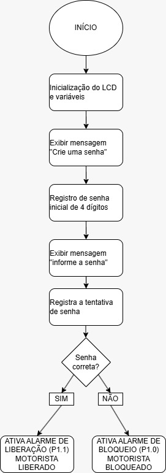
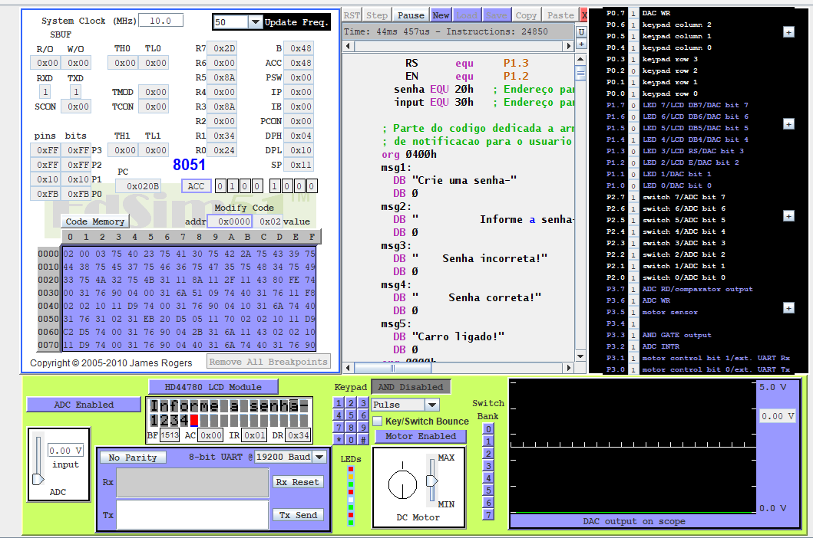
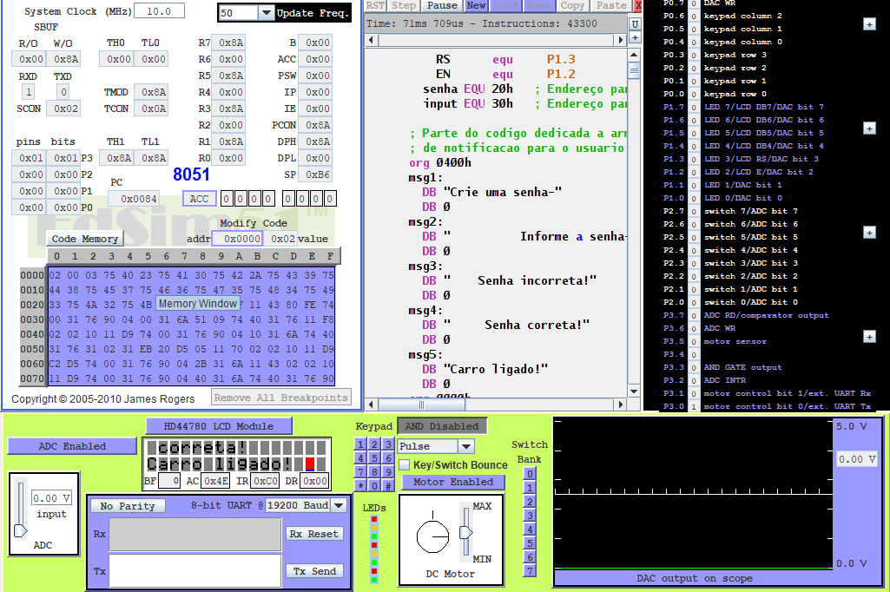

# Projeto de Arquitetura de Computadores - Sensor de Alarme de Entrada

## Integrantes:
- **Kawan Mark Geronimo da Silva** - RA: 22222010-5
- **Gabriel Albertini Pinheiro** - RA: 22124094-8

## Turma:
- 630, Noturno

### Funcionamento:
1. O sistema será iniciado aguardando a detecção de uma presença ou o acionamento pelo usuário.
2. Após a ativação, o usuário será solicitado a inserir uma senha através do **keypad**.
3. Caso a senha inserida esteja correta, o **LED** será acionado, indicando o alarme ativo.
4. Caso a senha esteja incorreta, o sistema continuará aguardando uma nova tentativa.

## Descrição do Projeto:
Este projeto consiste no desenvolvimento de um **sensor de alarme de entrada**, pensado para funcionar como um **sistema de segurança em veículos**. Utilizando os recursos disponíveis no **EDSIN51**, o objetivo é criar um dispositivo que detecta a presença de uma pessoa ou objeto e aciona um alarme visual.

### Componentes utilizados:
- **Display**: Exibe as mensagens e instruções necessárias para interação do usuário.
- **LEDs**: Indicadores visuais para demonstrar o estado do sistema de alarme (ativado ou desativado).
- **Keypad**: Utilizado para a entrada de senha. O alarme será disparado ou desativado com base na senha correta.

## Objetivos:
- Implementar um sistema de segurança com alarme visual (LEDs).
- Utilizar o **EDSIN51** para simular o comportamento de um sensor de alarme.
- Aplicar conceitos de **programação em Assembly** e **interação com hardware**, incluindo a leitura de entradas pelo **keypad** e o controle de saídas com **LEDs** e **display**.

## Desenvolvimento:
- O código é desenvolvido em **Assembly** para o processador **8051**, com foco na movimentação de dados e controle lógico.
- É utilizadas rotinas para leitura do **keypad**, verificação de senha e controle do **LED** de alarme.
- O projeto também inclui o uso de um **display** para interagir com o usuário durante a inserção da senha.

## Fluxograma:

## Imagens e vídeos:

## Conclusão:
Este projeto visa explorar a integração entre **hardware** e **software** utilizando Assembly, além de aplicar conceitos de controle de fluxo e verificações condicionais. Ao final, esperamos desenvolver um sistema funcional que possa ser aplicado como um modelo de segurança para veículos.
